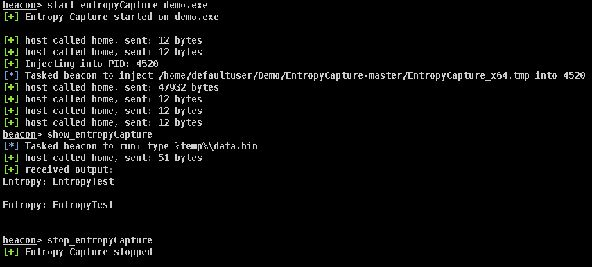

# EntropyCapture

EntropyCapture is a simple standalone DLL that, when injected into a process that is using optional entropy, will perform the API hooking, capture the entropy, and write the value to a file.
Converting the DLL into shellcode using the sRDI project allows the included aggressor script to monitor and inject into the provided process name. When started, EntropyCapture will retrieve a process list, search for the provided application name, and then inject into it.

When the aggressor script is loaded into Cobalt Strike, three new commands are available:

* start_entropyCapture [process name] – Starts checking for the stated process and injects into them.
* stop_entropyCapture – Stops checking but will not unload the already loaded DLL.
* show_entropyCapture – Prints the contents of the file showing the captured entropy.

## Screenshot

